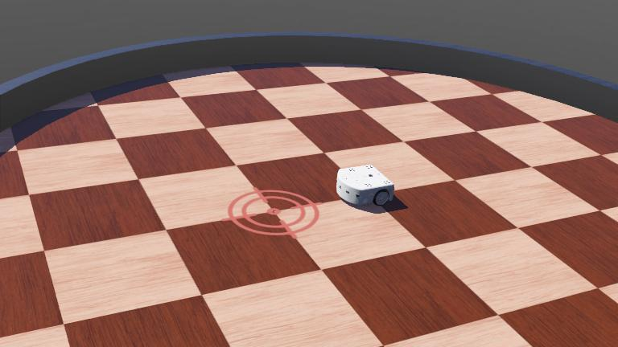

# My personal benchmark

## Description

Here is a short description of my benchmark...

## Information

- Difficulty: Bachelor
- Robot: epuck
- Language: python
- Commitment: a couple of hours

---

## How to participate

### Create your own entry repository from the template

- [Click here](../../generate) to create your own repository or do it manually by clicking on the green "Use this template" button.
- Fill the "Repository name" field with a name for your controller.
Choose the visibility of your controller, keep it "Public" if you don't care about people looking at your controller code otherwise set it to "Private".
Finally, click on the green "Create repository from template".

### Add the organizer as collaborator if you set your repository as private

You should now be on your own repository page. The URL should look like this: "https://github.com/YOUR_USERNAME/YOUR_REPOSITORY_NAME".  If it is not the case, go to your repositories and click on the first one from the list.

- Click on the "Settings" tab and then under the Access section click on "Collaborators"
  - You might need to confirm the access by re-entering your GitHub password.
- When this is done you should see a "Manage access" box where you will see the current collaborators of the repo.
Click on the "Add people" and search for "TotallyRandomGus". When you found the organizer, add them to the repository.

### Submit your entry by using posting an issue using the provided template

- After you added the organizer as a collaborator, go back to the main page of your repository and copy the repository URL from the address bar to your clipboard.
- Come back to the organizer's page and [click here](../../issues/new?assignees=&labels=registration&template=registration_form.yml&title=Registration+to+benchmark) (on their page) to start your registration. Be sure to register on the organizer page and not on your own repository! If it doesn't work, you can do it manually by going to the organizer's "Issues" tab, creating a new issue and choosing the "Registration to benchmark" template.
- Paste your repository URL in the URL field and click the "Submit new issue" button.

A series of automated actions will take place in a few seconds. If everything went well, you should get a message saying that you are successfully registered to the benchmark. If there was a problem, read the feedback message to fix what went wrong. When you finished fixing your repository, you can post a "retry" comment on the registration issue to re-run the automated verifications.

### Modify the template controller and/or create your own one

Everything should be good to go, you can modify the main controller files in the controllers folder.

The supervisor controller is the special controller that is used to evaluate your controller's performance.

Webots supports multiple programming languages, see the [Webots documentation](https://www.cyberbotics.com/doc/guide/language-setup) if you are interested.
Be sure to name your main controller like the default controller (except for the file extension) for it to be used in the leaderboard evaluation.
